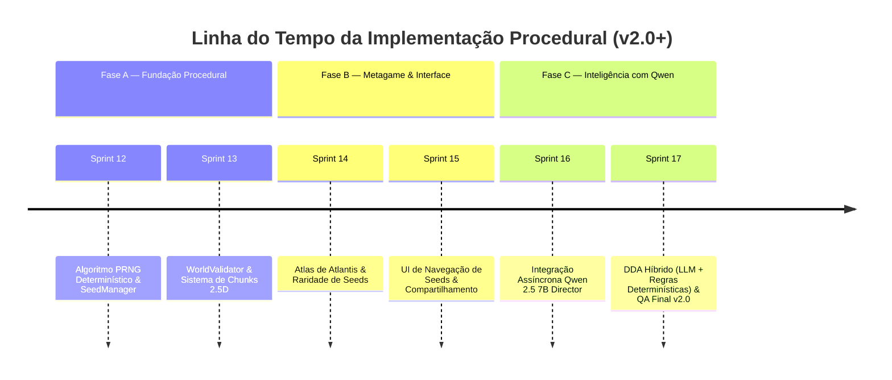

# 🌀 VISÃO V2.0+ — Oceano Procedural Orientado por Seeds & Qwen 2.5 7B Director

> **Documento de Arquitetura Futura (Pós-Sprint 11 / Versão 2.0+)**
> **Status:** 🔮 VISÃO FUTURA — Não executar antes da conclusão do Plano Holístico v1.0 (Sprints 7 a 11).
> **Conceito Chave:** *"Cada seed representa uma Atlantis possível. Algumas nunca foram encontradas."*

---

## 📌 1. Visão Geral e Alinhamento Estratégico

Este documento especifica a transição arquitetural do jogo **As Águas de Apsu** para um universo de **exploração procedural determinística, infinita e orientada por Seeds**, com direção contextual fornecida pelo modelo local **Qwen 2.5 7B**.

> [!IMPORTANT]
> **Relação com o Plano Holístico de Melhorias:** Esta visão v2.0+ constrói **sobre a base sólida** estabelecida nas Sprints 7 a 11 ([`PLANO_DE_MELHORIAS_HOLISTICO.md`](./PLANO_DE_MELHORIAS_HOLISTICO.md)). Nada do que já foi implementado (as 5 fases autorais, o motor JavaFX Canvas 60 FPS, a biblioteca de assets 3D/2.5D e a física de mecânica dos fluidos) será descartado. As fases iniciais servirão como prólogo narrativo autoral.

```
┌─────────────────────────────────────────────────────────────────────────────────┐
│                      FLUXO NARRATIVO & DE GAMEPLAY (v2.0+)                      │
├─────────────────────────────────────────────────────────────────────────────────┤
│ 1. PRÓLOGO AUTORAL (Fase 1 - Águas Claras)                                      │
│    └─► Apresentação do herói Adapa, movimentação e física aquática.             │
│                                                                                 │
│ 2. O DESPERTAR DO ARTEFATO (Fase 2 - Cavernas de Coral)                         │
│    └─► Navegação até o Galeão Naufragado ──► Abertura do Baú Ancestral         │
│    └─► ✦ DESPERTAR DO PODER DAS BOLHAS ✦                                      │
│                                                                                 │
│ 3. A ANOMALIA DO OCEANO PRIMORDIAL (Fase 3+ em diante ──► INFINITO PROCEDURAL)  │
│    └─► O oceano se desdobra em ruínas e biomas procedurais gerados por Seed.    │
│    └─► Direção de ritmo via Qwen 2.5 7B + Validação determinística sem lag.     │
└─────────────────────────────────────────────────────────────────────────────────┘
```

---

## 🧬 2. O Conceito da Seed: Mundos Determinísticos e Reprodutíveis

A seed não é um mero parâmetro aleatório; ela é a **identidade genética (World DNA)** de uma instância de Atlantis.

### 2.1 Pipeline de Geração Determinística

$$\text{SEED} \longrightarrow \text{SHA-256 / PRNG} \longrightarrow \text{WORLD DNA} \longrightarrow \text{BIOMAS} \longrightarrow \text{CHUNKS 2.5D} \longrightarrow \text{FASE}$$

```text
               SEED (ex: 739201)
                     │
                     ▼
         [ PRNG Determinístico (Seeded) ]
                     │
       ┌─────────────┼─────────────┐
       ▼             ▼             ▼
  [ Bioma ]     [ Layout ]    [ Ameaças ]
  (Recifes,     (Câmeras,     (Enguias,
   Ruínas,       Corredores,   Gêiseres,
   Vulcão)       Arenas)       Lava)
       │             │             │
       └─────────────┼─────────┬───┘
                     ▼         ▼
               [ WorldValidator ] ──(Fail)──► Re-seed Local
                     │
                  (Pass)
                     ▼
             [ Chunk 2.5D Baked ]
```

### 2.2 Reprodutibilidade Estrita

Para garantir que dois jogadores experimentem **exatamente a mesma Atlantis** ao compartilharem uma seed, a geração respeitará a tupla de versão:

```json
{
  "seed": 739201,
  "generator_version": "2.0.0",
  "world_rules_version": "1.0.0",
  "formatted_code": "ATLANTIS-739201-v2"
}
```

---

## 🌟 3. Raridade de Seeds & Atlas de Descobertas (Metagame)

Para transformar a exploração em um metagame coletivo, as seeds possuirão níveis de raridade calculados deterministicamente pelo **World DNA**:

| Classe de Raridade | Probabilidade | Características Geradas |
|---|---|---|
| ⚪ **Comum** | 70.0% | Biomas padrões (Recifes, Corais), inimigos comuns (Peixe, Enguia). |
| 🔵 **Incomum** | 20.0% | Correntes cruzadas, iluminação de caustica alterada, densidade alta de baús. |
| 🟣 **Rara** | 7.5% | Bioma de Abismo Vulcânico antecipado, minas rúnicas, enxames de arraias. |
| 🟡 **Épica** | 2.0% | Presença de Ruínas Atlantes Invertidas, minibiomas de cristal bioluminescente. |
| 👑 **Lendária** | 0.49% | Aparição do **Leviatã Menor** como guardião de sala secreta com artefatos raros. |
| 🌌 **Mítica** | 0.01% | **Atlantis Primordial:** Versão corrompida com iluminação vermelha e Boss Kullullû Glacial. |

### 📖 O Atlas de Atlantis
O jogador terá um menu dedicado de **Descobertas (Atlas)**:
* Registro de seeds visitadas e catalogadas.
* Desbloqueio de insígnias ao encontrar seeds Raras ou Lendárias.
* Campo de entrada de texto para **digitar seeds de amigos** e carregar o mesmo mundo.

---

## 🤖 4. Arquitetura do Qwen 2.5 7B Director (LLM Assíncrono)

### 4.1 Princípio de Isolamento Assíncrono

> [!CAUTION]
> **Regra de Desempenho:** O LLM **nunca** executará no loop crítico de renderização (60 FPS) nem gerará código ou geometria arbitrária. Ele opera em uma thread de plano de fundo (`LLMWorker`), gerando apenas **intenções de ritmo (JSON)**.

```
┌─────────────────────────────────────────────────────────────────────────────────┐
│                          ARQUITETURA DE THREADS (v2.0+)                         │
│                                                                                 │
│   ┌─────────────────────────────────────────────────────────────────────────┐   │
│   │ MAIN GAME LOOP (60 FPS — Thread Principal JavaFX)                       │   │
│   │ Input ──► Physics (QuadTree) ──► Canvas Render ──► Audio                │   │
│   └────────────────────────────────────┬────────────────────────────────────┘   │
│                                        │ (Envia Métricas de Perfil)             │
│                                        ▼                                        │
│   ┌─────────────────────────────────────────────────────────────────────────┐   │
│   │ PROCEDURAL WORKER THREAD                                                │   │
│   │ Seed PRNG ──► Chunk Generator ──► WorldValidator ──► Cache de Chunks     │   │
│   └────────────────────────────────────▲────────────────────────────────────┘   │
│                                        │ (Ajusta Parâmetros de Ritmo)           │
│                                        │                                        │
│   ┌────────────────────────────────────┴────────────────────────────────────┐   │
│   │ LLM DIRECTOR THREAD (Assíncrona — Qwen 2.5 7B Local)                    │   │
│   │ Recebe Perfil do Jogador ──► Processa Prompt JSON ──► Emite Intenção    │   │
│   └─────────────────────────────────────────────────────────────────────────┘   │
└─────────────────────────────────────────────────────────────────────────────────┘
```

### 4.2 Exemplo de Entrada e Saída do `LLMDirector`

* **Entrada (Resumo do Perfil enviado ao Qwen):**
```json
{
  "player_skill": 0.82,
  "health_ratio": 0.45,
  "recent_deaths": 0,
  "bubble_power_unlocked": true,
  "current_biome": "Cavernas_de_Coral"
}
```

* **Saída (Intenção Estruturada retornada pelo Qwen):**
```json
{
  "intent": "high_tension_reward",
  "target_biome": "Correntes_Abissais",
  "enemy_budget": 5,
  "hazard_density": 0.7,
  "reward_type": "tablet_fragment",
  "avoid_patterns": ["geyser_spam"]
}
```

* **Fallback Automático:** Se o servidor Qwen local estiver indisponível ou demorar mais de 300ms, o `DifficultyDirector` determinístico assume imediatamente sem provocar travamentos.

---

## 🛡️ 5. Sistema de Validação de Conteúdo (`WorldValidator`)

Para prevenir *soft-locks* (jogadores presos em fases procedurais sem saída), todo Chunk ou Fase gerada passará obrigatoriamente pelo `WorldValidator`:

- [x] **Caminho Concluível:** Existe ao menos uma trajetória viável do ponto de spawn à saída?
- [x] **Spawn Seguro:** O ponto inicial do herói está livre de dano imediato de lava/gêiseres?
- [x] **Requisitos de Poder:** Desafios que exigem o Disparo de Bolhas só aparecem se o poder estiver ativo?
- [x] **Densidade Balanceada:** A distância entre obstáculos permite recuperação de empuxo?
- [x] **Variância Perceptual:** O layout gerado é perceptivelmente diferente das últimas 3 fases jogadas?

---

## 🏛️ 6. Reutilização de Assets e Integração com a v1.0

O sistema procedural **não tentará síntese 3D em tempo real**. Ele utilizará como blocos de construção (*tilesets/chunks*) a biblioteca de assets 3D procedurais já desenvolvida em Blender:

```text
BIBLIOTECA DE CHUNKS 2.5D REUTILIZÁVEIS:
├── BIOMAS      : Recifes, Cavernas de Coral, Correntes Abissais, Vulcão, Templo de Apsu.
├── ESTRUTURAS  : Galeão Naufragado, Baús Ancestrais, Colunas de Mármore, Obeliscos.
├── FAUNA       : Peixe Sombrio, Enguia, Medusa, Caranguejo, Arraia, Leviatã Menor.
└── PERIGOS     : Gêiseres Hidrotermais, Zonas de Pressão, Correntes, Lagoas de Lava.
```

---

## 🗓️ 7. Roadmap de Integração (Pós-Sprint 11)



---

<div align="center">

**Visão Arquitetural v2.0+ — Aprovada como Roteiro Futuro**

</div>
